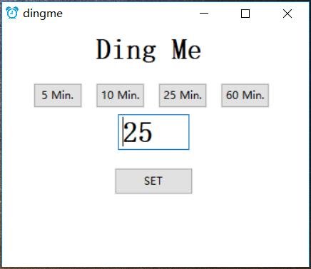

# dingme

dingme is a simple alarm clock.

Just download [dingme.zip](https://github.com/wensheng/dingme/releases/download/v1.0/dingme.zip), extract and run dingme.exe.

## SNAQ

1. What's SNAQ?

   Seldom or Never Asked Questions.

2. Why this?

   Because saying "Alexa, set an timer for twenty five minutes" takes too much time.  Setting alarm with dingme takes only 2 mouse clicks.

3. No, Seriouly, why this?

   You're on headphones or don't want to use Alexa, and Windows "Alarms & Clock"  and other alarm clocks are over-kills.

4. How do I use it?

   Enter a number for minutes, or click one of 4 preset buttons, click "SET".

5. Why 25 minutes default?

   Because it is the default time interval in [Pomorodo](https://en.wikipedia.org/wiki/Pomodoro_Technique)

6. Is there a Mac/Linux version?

   No.  But it's open-source,  you can package it yourself.  Or you can just take dingme.py and run it on both Mac and Linux.  It requires WxPython.

7. What's the max number of minutes I can enter?

   9999 (about a week)

8. Can I request (feature, preset, sound to be added)?

   No

